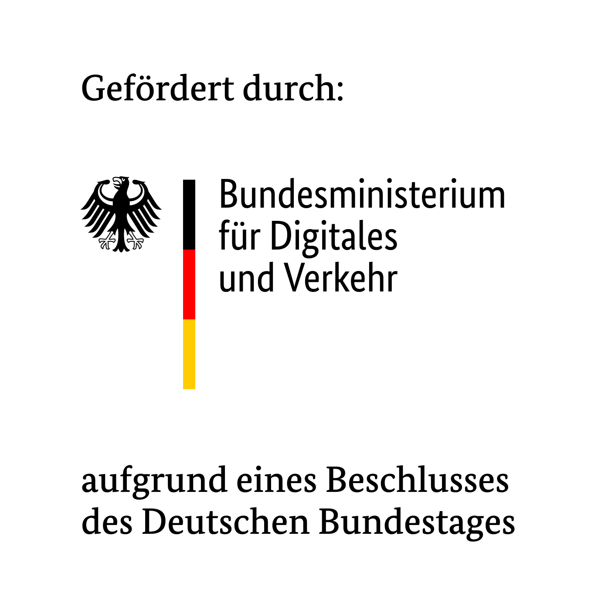

# SocialMedia2Traffic API

The [SocialMedia2Traffic](https://heigit.org/de/new-mfund-project-start-of-socialmedia2traffic-derivation-of-traffic-information-from-social-media-data-2/) (SM2T) API provides **modelled hourly traffic speed data** for individual OSM road features suitable for integration in [openrouteservice](https://openrouteservice.org).

The traffic speed was modelled using geocoded Twitter data and OpenStreetMap data using machine learning and [UBER movement data](https://movement.uber.com/?lang=en-US) as reference.

**Currently available cities** incl. bounding box:

- **Berlin:** [13.088333,52.338241,13.760469,52.674915]
- **Nairobi:** [36.663475,-1.4421585,37.103702,-1.157910]
- **Seattle:** [-123.503379,46.728870,-120.905265,48.411334]

**Note:** Since this is a rather a demonstrator and not a productive system, the size of the bounding box per request is limited to a width and height of 0.2 degree at the moment.

## Usage

Traffic data can be queried from [https://sm2t.heigit.org/download/traffic/csv](https://sm2t.heigit.org/download/traffic/csv) using GET requests by providing a spatial bounding box in geographic coordinates (min_lon, min_lat, max_lon, max_lat).


**Example Query**

```
curl http://sm2t.heigit.org/download/traffic/csv?bbox=13.3472,52.499,13.4117,42.5304
```

The response is a **CSV file** containing **hourly traffic speed in km/h** for individual OSM highway segments, e.g.

**Example Response**


```
osm_way_id,osm_start_node_id,osm_end_node_id,hour_of_day,speed_kph_p85
4615004,12614644,29266235,6,41
4615004,12614644,29266235,7,28
4615004,12614644,29266235,8,28
4615004,12614644,29266235,9,22
4615004,12614644,29266235,10,29
```

The data structure is the same as UBER movement data. The first three columns denote **official OSM IDs**, so the respective OSM objects can be viewed on [https://www.openstreetmap.org](https://www.openstreetmap.org), e.g.
- [https://www.openstreetmap.org/way/4615004](https://openstreetmap.org/way/4615004)
- [https://www.openstreetmap.org/node/12614644](https://www.openstreetmap.org/node/12614644).

## API Setup

Copy the `sample.env` to `.env` and set the envrionment variables. Afterwards, set up the API using [Docker](https://www.docker.com/):

```
cd socialmedia2traffic-api
cp sample.env .env
docker compose up
```

## Contributing

If you encounter problems or bugs, please open an [issue](https://github.com/GIScience/socialmedia2traffic-api/issues). Pull requests are welcome. For major changes, please open an issue first to discuss what you would like to change. Also please make sure to update tests as appropriate.

## Acknowledgements

This project was funded by the [German Federal Ministry for Digital and Transport (BMDV)](https://www.bmvi.de/EN/Home/home.html) in the context of the research initiative [mFUND](https://www.bmvi.de/EN/Topics/Digital-Matters/mFund/mFund.html).

Project term: 02/2021 - 01/2021

<p float="left">


</p>
